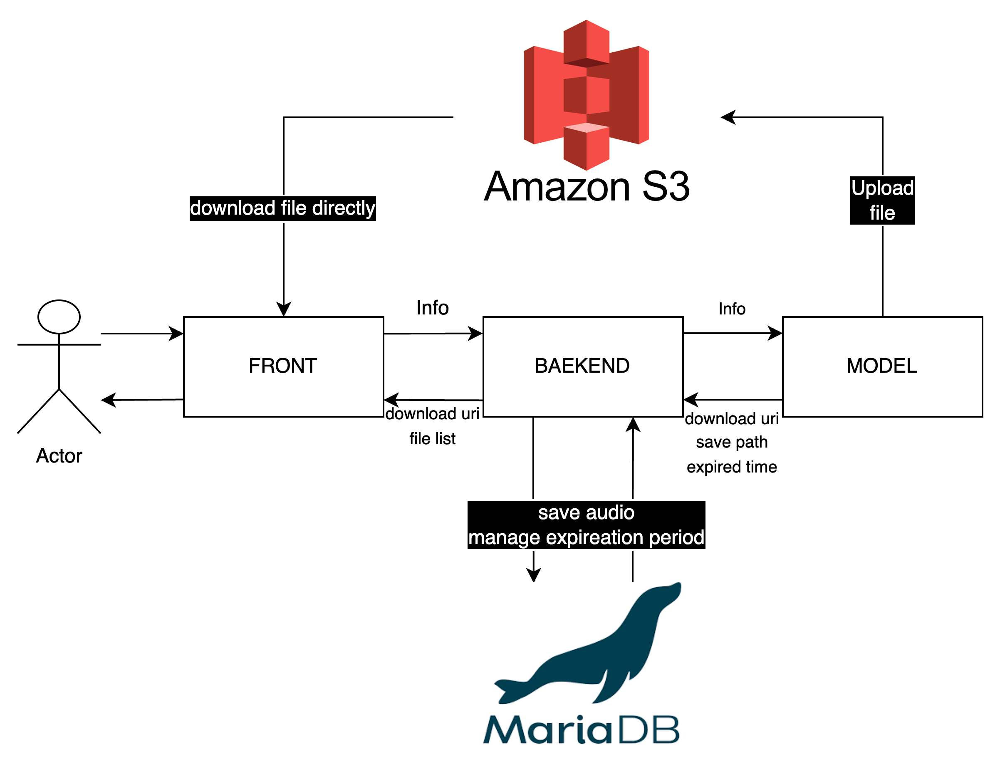

# 프로젝트 목적

인공지능 모델을 사용하여 벨소리를 만들어 보고 싶었다.

해당 프로젝트는 클라이언트가 프론트 엔드에게 만들고 싶은 벨소리에 대한 설명과 음성 길이를 전달한다.

프론트 엔드가 음성 길이에 맞는 토큰 수를 수정하여 백엔드에게 설명과 토큰 수를 전달한다.

백엔드는 전달받은 토큰 수와 설명을 인공지능 모델이 장착되있는 FastApi 기반 서버에게 전달한다.

인공지능 모델 서버에서 해당 데이터를 통해 멜로디를 생성하면 S3에 저장하고 pre-signed uri과 만료 날짜를 백엔드에게 전달한다.

백엔드에서는 해당 데이터들을 기반으로 프론트에게 데이터를 제공하고 해당 데이터를 기반으로 DB관리를 수행한다.

그럼으로 사용자는 이 전의 음성을 DB에 조회만 해도 조회할 수 있다.

해당 프로젝트는 백엔드에 초점이 맞춰져있기 때문에 프론트는 간단히 Thymeleaf 를 통해 구현하였다.

# 다이어그램



# 다이어그램 설명

## S3 선택 이유

음성 데이터 자체가 많이 무겁지 않기 때문에, Base64로 인코딩하는 방식으로 음성 파일을 전송하고자 하였다.

음성 파일을 백엔드 DB에 저장하자니 백엔드 서버가 과부하가 올 가능성이 높아보였다.

그리고 인공지능 모델의 특성상 하나의 입력뿐만 아니라 다양한 입력을 원 큐에 넣을 수 있기 때문에 한번 전송하는 음성들의 개수가 많을 것이라 판단하였다.

그래서 S3를 선택하였다.

S3의 주된 기능은 스토리지 기능이다.

그럼으로 음성파일을 저장하고 불러오기가 편하고 특히, 수명 주기르 관리할 수 있음으로 장기 관리가 필요없는 음성 파일에는 적합하였다.

S3에 pre-signed uri 기능을 제공하여 사용자가 해당 음성을 받기 위해 백엔드를 거치지 않고 바로 S3에 전송받을 수 있다는 장점이 있다.

## 만료 관리

DB서버에는 uri와 함께 만료 날짜를 함께 저장한다.

S3에 특정 시간을 반복하여 조회할 수 있지만 해당 방법은 속도 면에서 좋지 않아 보여, 백엔드 DB에서 관리하도록 하였다.

# 인공지능 모델 설명

멜로디 메이커라는 기능을 수행하기 적합한 모델인 MusicGen 모델을 사용하였다.

해당 모델은 자기 회귀적 변환기(autoregressive transformer) 모델로, 텍스트 또는 멜로디 표현을 기반으로 음악을 생성한다.

해당 모델은 음성 혹은 텍스트를 기반으로 오디오를 만들 수 있다.

하지만 모델에서 음성을 input으로 넣게 되면 최대 20초를 넣을 수 있고 10초 이상의 결과물을 얻을 수 없기 때문에 음성 입력 부분은 생략하였다.

자세한 설명은 [MusicGen 모델](https://huggingface.co/facebook/musicgen-small)을 참고 바란다.


# 인공지능 모델 코드

FastApi를 통해 서버를 만들고 해당 서버에 MusicGen모델을 장착하였다.

그 이유는 백엔드 서버에서 모델까지 생성하여 서비스하기엔 과부화 위험이 매우 크고 해당 모델은 Python에 친화적이기 때문에 python 기반의 FastApi를 사용해서 백엔드와 데이터를 주고 받는 형식으로 작성하였다.

해당 코드가 존재하는 [깃허브 주소](https://github.com/gwj0421/aiMelodyMaker)이다.

# 코드 구조

```
├── main
│   ├── java
│   │   └── ics
│   │       └── mgs
│   │           ├── MgsApplication.java
│   │           ├── config
│   │           │   ├── property
│   │           │   │   ├── CorsProperty.java
│   │           │   │   └── S3property.java
│   │           │   ├── scheduler
│   │           │   │   └── CleanScheduler.java
│   │           │   ├── security
│   │           │   │   └── SecurityConfig.java
│   │           │   └── web
│   │           │       ├── CorsConfig.java
│   │           │       ├── QueryDslConfig.java
│   │           │       ├── S3ClientConfig.java
│   │           │       ├── ServiceConfig.java
│   │           │       └── WebClientConfig.java
│   │           ├── controller
│   │           │   └── MusicGenController.java
│   │           ├── dao
│   │           │   ├── Bell.java
│   │           │   └── SiteUser.java
│   │           ├── dto
│   │           │   ├── FileResponse.java
│   │           │   └── InputForm.java
│   │           ├── error
│   │           │   └── UserNotFound.java
│   │           ├── repository
│   │           │   ├── BellRepository.java
│   │           │   └── SiteUserRepository.java
│   │           ├── service
│   │           │   ├── database
│   │           │   │   ├── bell
│   │           │   │   │   ├── BellRepositoryService.java
│   │           │   │   │   └── BellRepositoryServiceImpl.java
│   │           │   │   └── site_user
│   │           │   │       ├── SiteUserRepositoryService.java
│   │           │   │       └── SiteUserRepositoryServiceImpl.java
│   │           │   └── musicgen_service
│   │           │       ├── MusicGenService.java
│   │           │       └── MusicGenServiceImpl.java
│   │           └── utils
│   │               └── TimeUtils.java
│   └── resources
│       ├── application.yml
│       ├── static
│       └── templates
│           ├── audio_form.html
│           ├── css
│           │   └── music_form.css
│           └── user_audio_form.html
└── test
    └── java
        └── ics
            └── mgs
                ├── MgsApplicationTests.java
                ├── repository
                │   └── RepositoryTest.java
                ├── service
                │   └── database
                │       ├── bell
                │       │   └── BellRepositoryServiceTest.java
                │       └── site_user
                │           └── SiteUserRepositoryServiceTest.java
                └── utils

```


